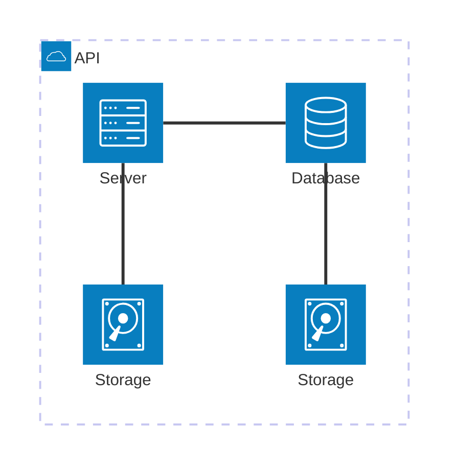
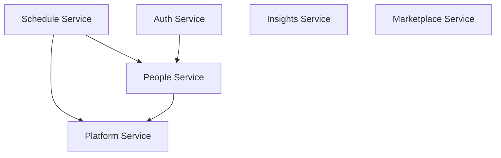

```mermaid
architecture-beta
    group api(cloud)[API]

    service db(database)[Database] in api
    service disk1(disk)[Storage] in api
    service disk2(disk)[Storage] in api
    service server(server)[Server] in api

    db:L -- R:server
    disk1:T -- B:server
    disk2:T -- B:db
```

```mermaid
flowchart TD
    Schedule[Schedule Service]
    People[People Service]
    Platform[Platform Service]
    Auth[Auth Service]
    Insights[Insights Service]
    Marketplace[Marketplace Service]

    Schedule -->People
    Schedule --> Platform
    People --> Platform
    Auth --> People
```
